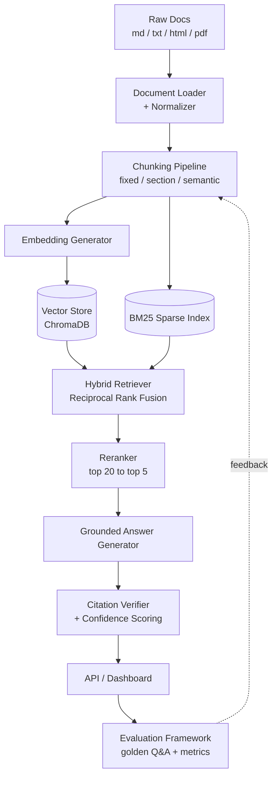

# Architecture Overview

RAG Pipeline with Hybrid Search is a production-style Retrieval-Augmented Generation
system for internal documentation. It combines **dense vector search** (semantic
similarity) with **sparse BM25 search** (exact keyword matching), fuses both result
sets, reranks the fused candidates, and generates grounded answers with verified
inline citations.

This folder is the system's design documentation. It is tracked in git and kept up
to date as each phase of the [build plan](../README.md#build-plan) lands.

- **[pipeline.md](pipeline.md)** — stage-by-stage data flow: what each component
  takes in, what it produces, and why it exists.
- **[tech-stack.md](tech-stack.md)** — technology choices, key design decisions, and
  the tradeoffs behind them.

## System Diagram



## Design Principles

1. **Same chunk IDs everywhere.** Dense and sparse indexes are built from the exact
   same chunk corpus, so a result from either retriever can be traced back to one
   canonical chunk and one source document.
2. **Metadata travels with every chunk.** Source file, section heading, chunking
   strategy, and character count are stored alongside every embedding — citations
   are only as good as the metadata backing them.
3. **Hybrid over dense-only.** Internal docs mix natural-language explanations with
   exact identifiers (error codes, config keys, function names). Dense search alone
   under-retrieves the latter; BM25 alone under-retrieves the former.
4. **Say "I don't know."** When retrieval confidence is below threshold, the system
   returns what it found, what it couldn't find, and which documents to check
   manually — instead of generating a fabricated answer.
5. **Evaluation is first-class.** A hand-built golden Q&A set and automated metrics
   (faithfulness, citation accuracy, retrieval relevance) exist from early on, not
   bolted on at the end.

## Repository Layout

```text
RAG_Pipeline/
  README.md              Project overview, setup, usage
  architecture/          This folder — tracked, public design docs
  src/rag_pipeline/       Application source (see module breakdown in pipeline.md)
  tests/                  Unit tests per module
  data/
    raw/                  Sample internal-doc corpus (tracked)
    eval/                 Golden Q&A evaluation set (tracked)
    processed/            Normalized/chunked output (gitignored, regenerable)
    indexes/              Vector store + BM25 index files (gitignored, regenerable)
  docs/                   Local-only working notes (gitignored — day-by-day plan,
                           AI-assisted scratch notes). Not part of the public repo.
```
